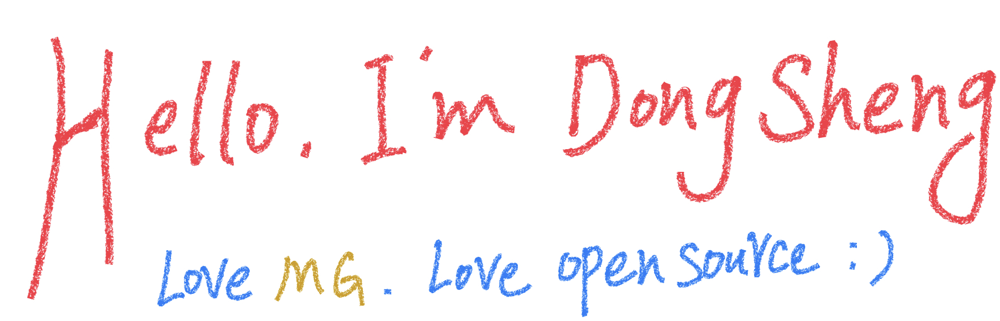

 

“Talk is cheap. Show me the code.”

**About me**

- 🥤 I'm Dongsheng · Skiing · Mountaineering · Rollerblading · Barbecuing · Swimming · Wang

- 🧘🏽 I'm a PhD candidate from [Xidian University](https://www.xidian.edu.cn)

- ❤️ I majored in Bayesian generative model, machine learning, artificial intelligence

- 💬 有东升的地方就一定有阳光

